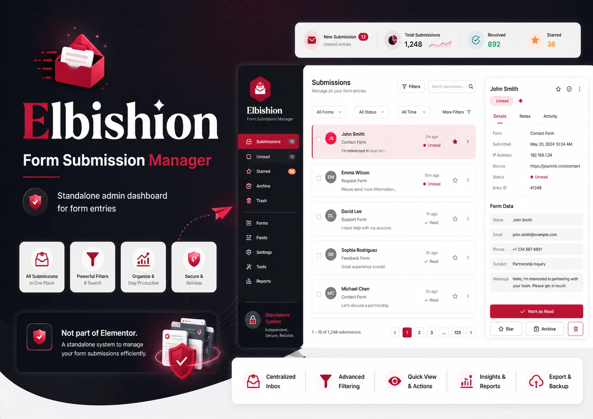

# Elbishion



Elbishion is a standalone WordPress form submissions manager. It stores submissions from the built-in shortcode form, a small developer API, and optionally Elementor Pro Forms. The plugin adds a dedicated WordPress admin workspace for searching, filtering, viewing, status management, CSV export, notifications, and privacy-related storage controls.

## Version

Current version: `1.0.0`

Recommended Git tag: `v1.0.0`

Author: Abe Prangishvili

## Features

- WordPress admin menu for all submissions, unread submissions, starred submissions, archived submissions, and settings.
- Built-in frontend shortcode form.
- Developer function and action hook for saving custom form submissions.
- Optional Elementor Pro Forms capture through `elementor_pro/forms/new_record`.
- Submission detail view with field cards, message display, metadata, page URL, IP address, and user-agent where enabled.
- Search, form-name filtering, date filtering, ordering, pagination, and status filters.
- Bulk actions for marking read/unread, starring, archiving, exporting, and deleting submissions.
- CSV export for all, filtered, or selected submissions.
- Optional email notifications when new submissions are saved.
- Privacy controls for IP address and browser user-agent storage.
- Optional data deletion on uninstall.

## Requirements

- WordPress 5.8 or newer.
- PHP 7.4 or newer.
- MySQL/MariaDB supported by the active WordPress installation.
- Elementor Pro is optional and only required for automatic Elementor Forms capture.

## Installation

1. Download or clone this repository.
2. Copy the plugin folder into:

   ```text
   wp-content/plugins/elbishion
   ```

3. In WordPress admin, go to **Plugins**.
4. Activate **Elbishion**.
5. Open **Elbishion** in the WordPress admin menu.

On activation, the plugin creates a custom database table:

```text
{wp_prefix}_elbishion_submissions
```

It also creates default plugin settings if they do not already exist.

## Shortcode Usage

Add the default frontend form to any post, page, or builder shortcode widget:

```text
[elbishion_form]
```

Use a custom form name:

```text
[elbishion_form name="Contact Form"]
```

The shortcode form stores:

- name
- email
- phone
- subject
- message
- page URL
- IP address if enabled
- user-agent if enabled

The form includes nonce verification, server-side validation, sanitization, and a redirect confirmation flag after a successful submission.

## Developer API

Use the helper function when saving submissions from custom theme or plugin code:

```php
elbishion_save_submission(
	'Custom Quote Form',
	array(
		'name'    => 'Jane Doe',
		'email'   => 'jane@example.com',
		'message' => 'I would like a quote.',
	),
	array(
		'page_url' => home_url( '/quote/' ),
		'status'   => 'unread',
	)
);
```

The function returns the inserted submission ID on success and `false` on failure.

You can also use the action API:

```php
do_action(
	'elbishion_save_submission',
	'Custom Form',
	array(
		'email'   => 'client@example.com',
		'message' => 'Submitted from custom code.',
	)
);
```

After a submission is saved, the plugin fires:

```php
do_action( 'elbishion_submission_saved', $submission_id, $form_name, $submitted_data, $args );
```

This is useful for analytics, CRM syncing, custom notifications, or external automation.

## Elementor Pro Forms

If Elementor Pro is active, Elbishion listens to:

```php
elementor_pro/forms/new_record
```

The plugin reads the Elementor form name and submitted fields, then saves them into the Elbishion submissions table. No extra configuration is required.

## Admin Workflow

After activation, WordPress administrators can manage submissions from the **Elbishion** menu.

Available sections:

- All submissions
- Unread
- Starred
- Archived
- Settings

Available actions:

- view submission details
- mark as read
- mark as unread
- star
- archive
- delete
- export selected records to CSV
- export filtered records to CSV
- export all records to CSV

Only users with the `manage_options` capability can access and mutate submissions.

## Settings

The settings page controls:

- whether IP addresses are stored
- whether browser user-agent values are stored
- whether submissions/settings are deleted during uninstall
- admin pagination size
- email notification enablement
- notification recipient email

Pagination is constrained between 5 and 100 items per page.

## Data Storage

Submissions are stored in a custom database table with these core fields:

- `id`
- `form_name`
- `page_url`
- `user_ip`
- `user_agent`
- `submitted_data`
- `status`
- `created_at`
- `updated_at`

Submission field data is stored as JSON in `submitted_data`.

Supported statuses:

- `unread`
- `read`
- `starred`
- `archived`

## CSV Export

CSV exports are available from the admin list screens.

Export modes:

- selected submissions through bulk action
- currently filtered submissions
- all submissions

Exports are protected by WordPress capability checks and nonces.

## Privacy And Security

Elbishion is designed around WordPress security primitives:

- direct file access protection with `ABSPATH` checks
- nonce verification for frontend submission, admin actions, bulk actions, and exports
- `manage_options` capability checks for admin access
- WordPress sanitization before storage
- WordPress escaping before output
- prepared database operations for dynamic values
- safe redirects after frontend submission
- optional IP and user-agent storage controls
- optional cleanup during uninstall

Because form submissions may contain personal data, site owners should align usage with their privacy policy, retention policy, and local compliance requirements.

## Uninstall Behavior

By default, uninstalling the plugin does not delete saved submissions.

To permanently remove plugin data during uninstall:

1. Open **Elbishion > Settings**.
2. Enable the delete-on-uninstall option.
3. Save settings.
4. Uninstall the plugin from WordPress.

When enabled, uninstall cleanup removes:

- `{wp_prefix}_elbishion_submissions`
- `elbishion_settings`
- `elbishion_db_version`

## File Structure

```text
elbishion/
├── assets/
│   ├── css/
│   │   └── admin.css
│   └── js/
│       └── admin.js
├── includes/
│   ├── class-elbishion-activator.php
│   ├── class-elbishion-admin-list.php
│   ├── class-elbishion-admin-menu.php
│   ├── class-elbishion-database.php
│   ├── class-elbishion-export.php
│   ├── class-elbishion-settings.php
│   └── class-elbishion-submission-handler.php
├── elbishion.php
├── uninstall.php
└── README.md
```

## Release Checklist

Before publishing a new version:

1. Update the plugin header version in `elbishion.php`.
2. Update `ELBISHION_VERSION` in `elbishion.php`.
3. Update the version section in this README.
4. Run PHP syntax checks.
5. Test activation on a clean WordPress site.
6. Test shortcode submission.
7. Test admin status actions.
8. Test CSV export.
9. Create a version tag, for example `v1.0.0`.

## License

Elbishion is licensed under the GNU General Public License v2.0 or later.

See [LICENSE](LICENSE) for the full license text.
